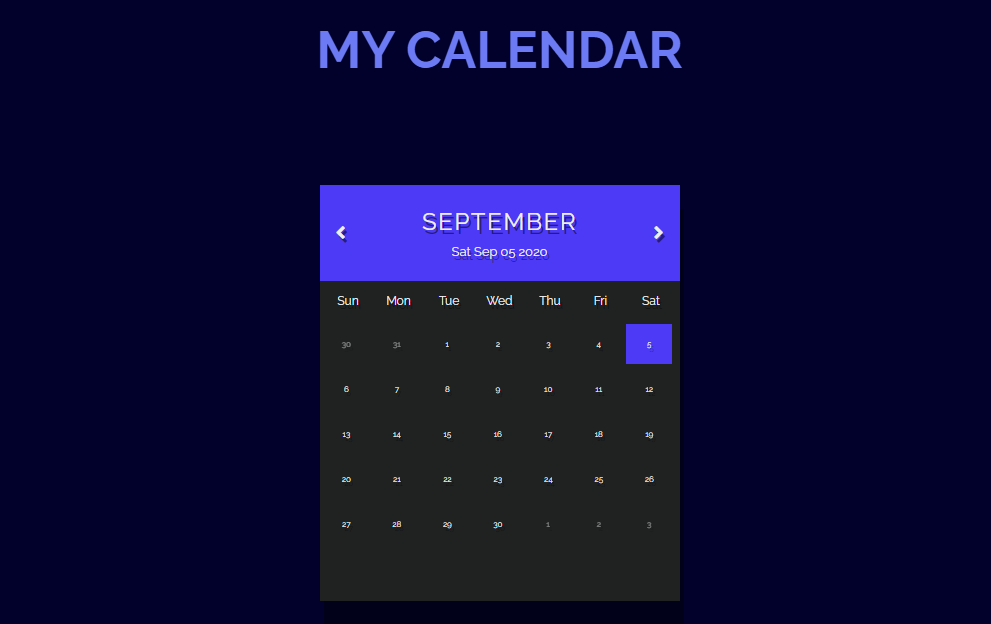

# Calendar Web JS

## Table of contents
* [General info](#general-info)
* [Technologies](#technologies)
* [Images](#images)

## General info
This project is a simple Calendar built with HTML,CSS and Javascript.
	
## Technologies
Project is created with:
* HTML5
* CSS3
* Javascript
	
### Images

;

